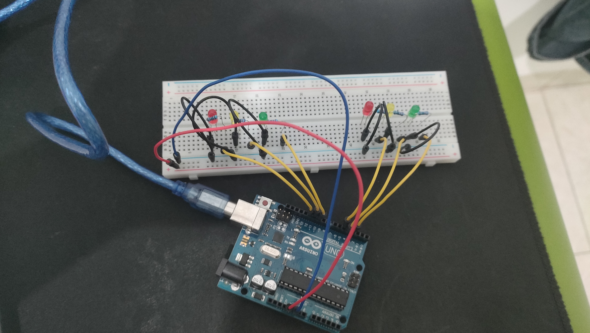
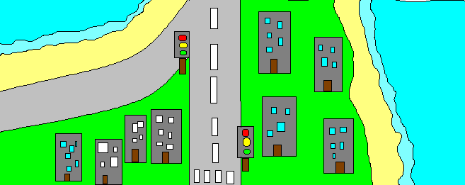

# Arduino - Traffic Light Simulator

## Setup

## Idea

it's a basic traffic light simulator, for a 1 way merging road it's very simple

## 📖 Live Preview

👀 You can view the live preview via [this youtube video](https://youtu.be/tx8sCMbdOBw)

## 🖥️ Technologies

In this project we used technologies such as:

- [Arduino uno R3](https://docs.arduino.cc/hardware/uno-rev3/) for the main controller
- Seeveral [jumper wires](https://en.wikipedia.org/wiki/Jump_wire)
- A [breadboard](https://en.wikipedia.org/wiki/Breadboard)
- 6 led
- 6 220 Ω resistors

## 📋 Additional information

### 🖥️ Code Logic
In loop(), it runs a sequence where the left side turns green while the right side is red (PhaseOne), waits 5 seconds, then transitions to yellow (yellowBlink), turns all lights off (PhaseThree), switches the left side to red (PhaseFour), blinks yellow on the right, then turns the right green (PhaseFive), waits 5 seconds, transitions the right side to yellow (PhaseSix and yellowBlink), and finally turns the right side red (PhaseSeven) before blinking the left yellow and looping back. The helper functions PhaseOne–PhaseSeven set specific light configurations, and yellowBlink() handles temporary yellow light activation for a specified side. This creates a repeating traffic light cycle controlling both directions.

### 🔌 Circuit Logic
The board setup is straightforward: each LED (left red, yellow, green; right red, yellow, green) is connected to its corresponding Arduino digital pin through a 220 Ω resistor to limit current and protect the LED. The cathode (short leg) of each LED is connected to ground, while the anode (long leg) goes through the resistor to the Arduino pin. The buzzer is wired with its positive terminal connected to pin 7 and its negative terminal to ground. The right-side button is connected to pin 2 (with either an external pull-down resistor or INPUT_PULLUP in software) so that pressing it changes the pin’s state. Essentially, the Arduino sends HIGH or LOW signals to each LED pin to turn them on or off in sequence, with the resistors ensuring safe operation, while the button can be used for triggering buzzer or manual overrides if programmed.
